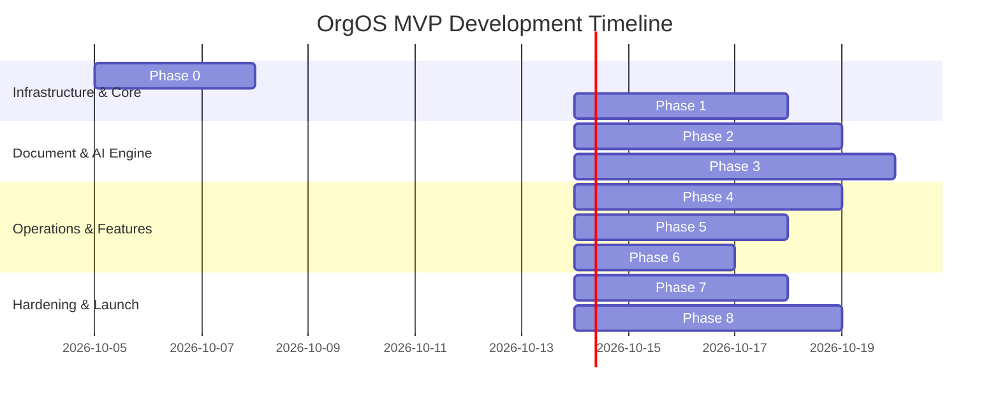
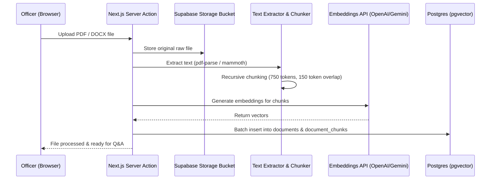

# 🗺️ OrgOS: Phase-by-Phase MVP Implementation Roadmap

This document outlines the engineering implementation plan for building the **OrgOS** MVP. It breaks down development into concrete, sequential phases with specific technical tasks, schema definitions, component architectures, and acceptance criteria.

---

## Roadmap Overview & Timeline



---

## Phase 0: Project Setup, Tooling & Architecture Scaffolding
**Goal:** Establish a robust TypeScript codebase with UI component libraries, environment configs, and CI/CD pipelines.

### Tasks:
- [ ] **Next.js 14+ Initialization**:
  - Scaffold project using `create-next-app` with App Router, TypeScript, and ESLint.
  - Configure `tailwind.config.ts` and install `@shadcn/ui` base components (Button, Dialog, DropdownMenu, Card, Toast, Table, Sheet, Tabs, Input).
  - Install `lucide-react` for icon consistency.
- [ ] **Supabase Setup**:
  - Initialize local Supabase project using Supabase CLI (`supabase init`).
  - Configure cloud project on Supabase and link local CLI (`supabase link`).
  - Enable required extensions: `pgvector`, `uuid-ossp`, `pgcrypto`.
- [ ] **State & Data Fetching**:
  - Set up `@tanstack/react-query` or Next.js server actions with optimistic UI patterns.
  - Setup `@supabase/ssr` client for authenticated server and client components.
- [ ] **Environment Configuration**:
  - Configure `.env.local` templates (`NEXT_PUBLIC_SUPABASE_URL`, `NEXT_PUBLIC_SUPABASE_ANON_KEY`, `SUPABASE_SERVICE_ROLE_KEY`, `OPENAI_API_KEY` / `GEMINI_API_KEY`).

### Deliverables:
- Deployable blank Next.js app running on Vercel.
- Connected Supabase instance with migrations pipeline configured.

---

## Phase 1: Multi-Tenant Architecture, Auth & Role Hierarchy
**Goal:** Implement strict multi-tenant data isolation, user authentication, and organizational role hierarchies.

### 1. Database Schema Migration
```sql
-- Organizations
CREATE TABLE organizations (
    id UUID PRIMARY KEY DEFAULT gen_random_uuid(),
    name TEXT NOT NULL,
    slug TEXT UNIQUE NOT NULL,
    university TEXT NOT NULL,
    logo_url TEXT,
    created_at TIMESTAMPTZ DEFAULT now()
);

-- Profiles (extends Supabase auth.users)
CREATE TABLE profiles (
    id UUID PRIMARY KEY REFERENCES auth.users(id) ON DELETE CASCADE,
    full_name TEXT NOT NULL,
    email TEXT UNIQUE NOT NULL,
    phone TEXT,
    avatar_url TEXT,
    created_at TIMESTAMPTZ DEFAULT now()
);

-- Role Enum
CREATE TYPE org_role AS ENUM ('president', 'treasurer', 'event_lead', 'officer', 'member');

-- Organization Memberships (Join Table)
CREATE TABLE org_memberships (
    id UUID PRIMARY KEY DEFAULT gen_random_uuid(),
    org_id UUID REFERENCES organizations(id) ON DELETE CASCADE,
    user_id UUID REFERENCES profiles(id) ON DELETE CASCADE,
    role org_role NOT NULL DEFAULT 'member',
    title TEXT, -- e.g., "Vice President", "Cultural Chair"
    joined_at TIMESTAMPTZ DEFAULT now(),
    is_active BOOLEAN DEFAULT true,
    UNIQUE (org_id, user_id)
);
```

### 2. Row-Level Security (RLS) Policies
- [ ] Enforce RLS on all tables: users can only read/write data linked to organizations they belong to.
- [ ] Create helper function `auth.is_org_member(org_id UUID)` and `auth.is_org_admin(org_id UUID)`.

### 3. Application Workflows & UI
- [ ] **Authentication**: Google OAuth sign-in + Email magic link screen.
- [ ] **Onboarding Wizard**:
  - *Option A*: "Create a new organization" (prompts org name, university, slug).
  - *Option B*: "Join via Invite Code" (join existing organization roster).
- [ ] **Member Directory**:
  - Searchable, filterable table of members with roles, titles, and active statuses.
  - Officer action: Promote/Demote roles, edit title, or deactivate membership.

### Acceptance Criteria:
- Users cannot read or query data from an organization they do not belong to.
- Newly registered users can create an organization or join with an invite link.

---

## Phase 2: Document Vault & Ingestion Pipeline
**Goal:** Enable officers to upload past files (PDF, DOCX, TXT) and process them into searchable text chunks and vector embeddings.

### 1. Database Schema for Knowledge Engine
```sql
-- Document Vault
CREATE TABLE documents (
    id UUID PRIMARY KEY DEFAULT gen_random_uuid(),
    org_id UUID REFERENCES organizations(id) ON DELETE CASCADE,
    uploaded_by UUID REFERENCES profiles(id),
    title TEXT NOT NULL,
    category TEXT NOT NULL, -- 'event_guide', 'budget', 'minutes', 'contact_list', 'general'
    file_path TEXT NOT NULL,
    file_size_bytes INTEGER NOT NULL,
    mime_type TEXT NOT NULL,
    summary TEXT,
    created_at TIMESTAMPTZ DEFAULT now()
);

-- Vector Document Chunks
CREATE TABLE document_chunks (
    id UUID PRIMARY KEY DEFAULT gen_random_uuid(),
    document_id UUID REFERENCES documents(id) ON DELETE CASCADE,
    org_id UUID REFERENCES organizations(id) ON DELETE CASCADE,
    content TEXT NOT NULL,
    chunk_index INTEGER NOT NULL,
    embedding VECTOR(1536), -- 1536 for text-embedding-3-small or 768 for Gemini
    metadata JSONB DEFAULT '{}'::jsonb,
    created_at TIMESTAMPTZ DEFAULT now()
);

-- Vector index for cosine similarity
CREATE INDEX ON document_chunks USING ivfflat (embedding vector_cosine_ops) WITH (lists = 100);
```

### 2. Ingestion Pipeline Workflow


### Tasks:
- [ ] Setup private Supabase Storage bucket `org-documents` with RLS.
- [ ] Implement file upload UI with drag-and-drop, progress bar, and category selection.
- [ ] Build background server ingestion worker with error handling for corrupted files.
- [ ] Build Document Vault UI to list, download, filter, and delete uploaded files.

### Acceptance Criteria:
- Uploading a multi-page PDF (e.g. "Diwali 2025 Post-Mortem.pdf") successfully populates `documents` and generates vectorized rows in `document_chunks`.

---

## Phase 3: The Killer Feature — AI Historical Copilot (RAG)
**Goal:** Give incoming and existing officers a natural language chat interface that retrieves answers directly from the organization's historical archive.

### 1. Vector Search Stored Procedure
```sql
CREATE OR REPLACE FUNCTION match_document_chunks (
    query_embedding VECTOR(1536),
    match_threshold FLOAT,
    match_count INT,
    filter_org_id UUID
)
RETURNS TABLE (
    id UUID,
    document_id UUID,
    content TEXT,
    similarity FLOAT,
    document_title TEXT,
    category TEXT
)
LANGUAGE plpgsql
AS $$
BEGIN
    RETURN QUERY
    SELECT
        dc.id,
        dc.document_id,
        dc.content,
        1 - (dc.embedding <=> query_embedding) AS similarity,
        d.title AS document_title,
        d.category
    FROM document_chunks dc
    JOIN documents d ON d.id = dc.document_id
    WHERE dc.org_id = filter_org_id
      AND 1 - (dc.embedding <=> query_embedding) > match_threshold
    ORDER BY dc.embedding <=> query_embedding
    LIMIT match_count;
END;
$$;
```

### 2. Copilot Architecture & Prompt Engineering
- [ ] **Context Injection**: Retrieve top 5-8 relevant chunks using `match_document_chunks`.
- [ ] **System Prompt**:
  > *"You are the AI Chief of Staff and Historical Archivist for [Organization Name]. Your job is to help student leaders understand how past events, budgets, logistics, and university policies were handled. Always cite the exact document title and context. If the historical record does not contain the answer, explicitly state that and recommend who or what department to contact."*
- [ ] **UI Implementation**:
  - Slide-out copilot drawer or dedicated `/copilot` chat interface.
  - Streaming responses using Vercel AI SDK (`useChat`).
  - **Source Citation Chips**: Clicking a chip reveals the source document snippet and a link to view the file.
  - **Quick Prompt Shortcuts**:
    - 🪔 *"How did we run our cultural showcase / Diwali last year?"*
    - 🏛️ *"What was our venue reservation timeline and who was our contact?"*
    - 💰 *"What did we spend on food and catering for our spring banquet?"*
    - 📋 *"Generate a 6-week checklist for our upcoming event."*

### Acceptance Criteria:
- Asking questions about an uploaded event report produces factually accurate answers with highlighted source citations.

---

## Phase 4: Event Management & Instant QR Attendance
**Goal:** Replace chaotic Google Forms and spreadsheets with single-click event creation and 3-second phone QR check-ins.

### 1. Database Schema
```sql
CREATE TABLE events (
    id UUID PRIMARY KEY DEFAULT gen_random_uuid(),
    org_id UUID REFERENCES organizations(id) ON DELETE CASCADE,
    title TEXT NOT NULL,
    description TEXT,
    location TEXT NOT NULL,
    start_time TIMESTAMPTZ NOT NULL,
    end_time TIMESTAMPTZ NOT NULL,
    check_in_code TEXT UNIQUE NOT NULL, -- 6-character shortcode
    is_active BOOLEAN DEFAULT true,
    created_at TIMESTAMPTZ DEFAULT now()
);

CREATE TABLE event_attendance (
    id UUID PRIMARY KEY DEFAULT gen_random_uuid(),
    event_id UUID REFERENCES events(id) ON DELETE CASCADE,
    org_id UUID REFERENCES organizations(id) ON DELETE CASCADE,
    user_id UUID REFERENCES profiles(id), -- Nullable for first-time non-member guests
    guest_name TEXT NOT NULL,
    guest_email TEXT NOT NULL,
    checked_in_at TIMESTAMPTZ DEFAULT now(),
    UNIQUE (event_id, guest_email)
);
```

### 2. Features & User Experience
- [ ] **Event Creation Form**: Title, date/time, venue/room number, and description.
- [ ] **QR Code Modal**:
  - Live generated QR code pointing to `/checkin/[check_in_code]`.
  - "Print Poster" view: generates a clean 8.5x11 printable PDF with org logo, event title, and prominent QR code.
- [ ] **Mobile Check-In Landing Page**:
  - Zero login required for new guests: enter Name + University Email + "Check In".
  - One-tap check-in if the user is already signed into OrgOS.
  - Prevents duplicate check-ins via unique constraint on `(event_id, guest_email)`.
- [ ] **Live Attendance Dashboard**:
  - Real-time counter of attendees.
  - "Export to CSV" button for university club reporting.

### Acceptance Criteria:
- A user can scan the QR code on a mobile device and complete check-in in under 5 seconds.
- Duplicate scans with the same email return a friendly "Already checked in!" message.

---

## Phase 5: Officer Transition Playbooks & Task Lists
**Goal:** Solve leadership amnesia through structured handover checklists and role dossiers.

### 1. Database Schema
```sql
CREATE TABLE transition_checklists (
    id UUID PRIMARY KEY DEFAULT gen_random_uuid(),
    org_id UUID REFERENCES organizations(id) ON DELETE CASCADE,
    role org_role NOT NULL,
    title TEXT NOT NULL,
    description TEXT,
    is_completed BOOLEAN DEFAULT false,
    completed_at TIMESTAMPTZ,
    completed_by UUID REFERENCES profiles(id)
);

CREATE TABLE officer_dossiers (
    id UUID PRIMARY KEY DEFAULT gen_random_uuid(),
    org_id UUID REFERENCES organizations(id) ON DELETE CASCADE,
    role org_role NOT NULL,
    outgoing_officer_id UUID REFERENCES profiles(id),
    incoming_officer_id UUID REFERENCES profiles(id),
    handover_notes TEXT,
    important_contacts JSONB DEFAULT '[]'::jsonb,
    status TEXT DEFAULT 'pending', -- 'pending', 'in_progress', 'completed'
    updated_at TIMESTAMPTZ DEFAULT now()
);
```

### 2. Pre-Loaded Handover Templates
Every new organization is pre-populated with standard collegiate transition tasks:
1. **Administrative & University Recognition**:
   - Re-register organization with Student Affairs / Campus Activities Office.
   - Complete mandatory university officer risk management training.
2. **Financial & Banking**:
   - Update official bank account signatory cards with outgoing/incoming President & Treasurer.
   - Transfer custody of checkbook, debit cards, and Venmo/Zelle accounts.
   - Audit last year's expense ledger and outstanding reimbursements.
3. **Digital Assets & Passwords**:
   - Transfer ownership of official email (@org.edu or Gmail).
   - Handover Instagram, Discord, and Linktree credentials.
4. **Key Relationships**:
   - Meet with Faculty Advisor.
   - Introduce new leadership to key department venue managers and regular catering vendors.

### 3. Transition UI
- [ ] Visual progress ring showing `% Handover Complete`.
- [ ] "Initiate Leadership Transition" button: prompts incoming officer emails, automatically reassigns roles, and opens the shared handover dossier.

### Acceptance Criteria:
- Outgoing officers can enter handover tips, check off completed milestones, and grant official role access to the incoming officer with one click.

---

## Phase 6: Basic Budget & Expense Tracker (MVP Scope)
**Goal:** Provide lightweight, transparent ledger tracking linked directly to events and documents.

### 1. Database Schema
```sql
CREATE TABLE expenses (
    id UUID PRIMARY KEY DEFAULT gen_random_uuid(),
    org_id UUID REFERENCES organizations(id) ON DELETE CASCADE,
    event_id UUID REFERENCES events(id) ON DELETE SET NULL,
    recorded_by UUID REFERENCES profiles(id),
    title TEXT NOT NULL,
    amount NUMERIC(10, 2) NOT NULL,
    category TEXT NOT NULL, -- 'catering', 'venue', 'marketing', 'decor', 'equipment'
    receipt_url TEXT,
    reimbursement_status TEXT DEFAULT 'pending', -- 'pending', 'approved', 'reimbursed'
    date_incurred DATE NOT NULL,
    created_at TIMESTAMPTZ DEFAULT now()
);
```

### 2. Features:
- [ ] Simple expense entry: title, dollar amount, category, date, and receipt image upload.
- [ ] Filter expenses by event (e.g. see total spend for "Diwali 2025").
- [ ] Reimbursement status toggle (helps Treasurer track who is owed money).
- [ ] Summary metric cards: Total Spend, Spend by Category, Outstanding Reimbursements.

### Acceptance Criteria:
- An officer can upload a receipt photo, log a $150 catering expense linked to an event, and view the updated event budget summary.

---

## Phase 7: Security Audit, Hardening & Polishing
**Goal:** Ensure enterprise-grade multi-tenant security, rate limiting, and flawless mobile experience.

### Tasks:
- [ ] **Multi-Tenancy Penetration Test**:
  - Run automated tests verifying that User A in Org 1 cannot fetch documents, events, or member emails from Org 2 via manipulated API calls.
- [ ] **AI Rate Limiting & Abuse Prevention**:
  - Implement per-org token quotas using Upstash Redis or Supabase RPC limits to prevent runaway LLM costs.
- [ ] **Mobile Responsiveness Pass**:
  - Test and refine check-in, dashboard navigation, and copilot chat on iOS Safari and Android Chrome.
- [ ] **PWA (Progressive Web App) Manifest**:
  - Add `manifest.json` and service worker so officers can install OrgOS on their home screen like a native app.

---

## Phase 8: Dogfooding & Campus Beta Launch
**Goal:** Deploy with real campus organizations (e.g. Hindu Yuva / Vivekananda House / cultural clubs) to gather operational feedback.

### Execution Plan:
1. **Data Seeding**:
   - Ingest 10-15 real historical documents (past budget sheets, venue booking emails, event recaps, flyers).
2. **Simulation Exercise with Student Officers**:
   - Test queries:
     - *"What vendors did we order samosas and chai from?"*
     - *"What was the step-by-step room reservation process for the student union?"*
     - *"Draft the announcement email for general body meeting #1."*
3. **Live Event Check-in**:
   - Run the QR code check-in engine at a live campus meeting with 30-50 attendees.
4. **Officer Feedback Loop**:
   - Record UX friction points, latency, and attendance completion rates.
   - Refine prompt templates based on common student officer questions.

---

## Summary Checklist for MVP Launch

| Milestone | Phase | Priority | Status |
| :--- | :--- | :--- | :--- |
| Next.js + Supabase + pgvector Scaffolding | Phase 0 | P0 | Pending |
| Multi-tenant Auth & Organization Roles | Phase 1 | P0 | Pending |
| Document Vault Upload & Vector Ingestion | Phase 2 | P0 | Pending |
| AI Historical Copilot with Citations | Phase 3 | P0 (Killer Feature) | Pending |
| Event Creation & QR Attendance Scanner | Phase 4 | P0 | Pending |
| Officer Transition Checklist & Dossier | Phase 5 | P1 | Pending |
| Lightweight Expense & Receipt Tracker | Phase 6 | P1 | Pending |
| Security Hardening & Rate Limiting | Phase 7 | P0 | Pending |
| Real Campus Beta & Dogfooding | Phase 8 | P0 | Pending |
